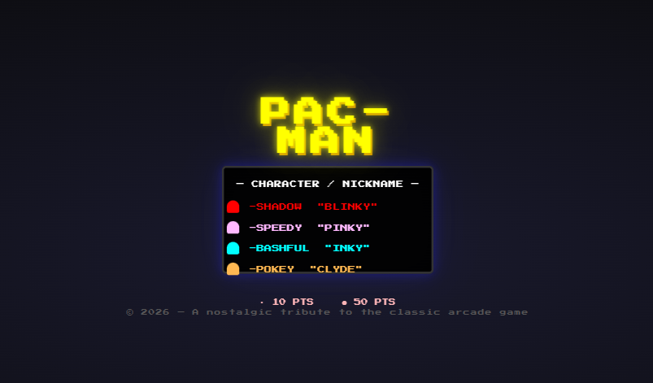

# 🕹️ PAC-MAN

> A classic Pac-Man arcade game built with vanilla JavaScript and HTML5 Canvas

<p align="center">
  
</p>

## 🎮 Play Now

👉 **[Play in your browser](https://yourusername.github.io/pacman-jsf/)** — no install needed!

## ✨ Features

- 🎮 **Classic 28×31 maze** — faithful recreation of the original
- 👻 **4 ghost personalities** — Blinky, Pinky, Inky, and Clyde with authentic AI
- ⚡ **Power pellets** — eat ghosts for chain bonus (200→400→800→1600 pts)
- ❤️ **Lives system** — 3 lives, extra life at 10,000 points
- 🏆 **High score tracking** & level progression
- 🎨 **Pixel-art rendering** — animated Pac-Man, ghost shapes with expressive eyes
- 📺 **CRT scanline overlay** & neon glow effects
- 🎵 **Retro "Press Start 2P"** arcade font
- 📱 **Responsive layout** — scales to any screen size

## 🕹️ How to Play

| Control | Action |
|---------|--------|
| `Arrow Keys` / `WASD` | Move Pac-Man |
| `Enter` | Start / Restart |

- Eat all dots to advance to the next level
- Avoid ghosts — unless you eat a power pellet!

## 🚀 Run Locally

```bash
git clone https://github.com/yourusername/pacman-jsf.git
cd pacman-jsf
npx http-server -p 8080
```

Then open [http://localhost:8080](http://localhost:8080)

## 🛠️ Tech Stack

- **Vanilla JavaScript** (ES modules)
- **HTML5 Canvas** (2D rendering)
- **CSS3** (CRT effects, responsive scaling)
- No dependencies, no bundler
- **111 unit tests** (Node.js built-in test runner)

## 📁 Project Structure

```
pacman-jsf/
├── index.html              # Entry point
├── css/
│   └── style.css           # CRT effects & responsive layout
├── src/
│   ├── main.js             # Bootstrap & game loop
│   ├── game.js             # Game state machine
│   ├── maze.js             # Maze layout & tile logic
│   ├── renderer.js         # Canvas rendering engine
│   ├── input.js            # Keyboard input handling
│   ├── config.js           # Game constants & settings
│   ├── entities/           # Pac-Man, ghosts, pellets
│   └── ui/                 # HUD, menus, overlays
├── tests/                  # Unit tests
├── assets/
│   └── screenshot.png      # Game screenshot
└── package.json
```

## 📄 License

[MIT](LICENSE)

---

<p align="center">
  A nostalgic tribute to the classic arcade game 🕹️
</p>
